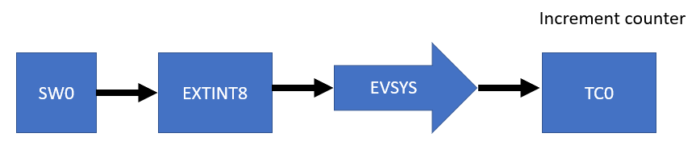

# ATSAMR34_LORAWAN_SMART_METER


> “Wireless Made Easy!" - Enable pulse counting on a Low Power LoRaWAN Application

<p>
<a href="https://www.microchip.com/design-centers/wireless-connectivity/low-power-wide-area-networks/lora-technology/sam-r34-r35" target="_blank">

&nbsp;&nbsp;&nbsp;&nbsp;&nbsp;&nbsp;&nbsp

</p>
</a>

## ⚠ Disclaimer

<p><span style="color:red"><b>
THE SOFTWARE ARE PROVIDED "AS IS" AND GIVE A PATH FOR SELF-SUPPORT AND SELF-MAINTENANCE.</br></br>
This repository contains unsupported example code intended to help accelerate client product development. It is not validated for production nor audited for security best-practices.</br></br>
Note that while this repository is unsupported, Microchip welcome community contributions, and all pull-requests will be considered for inclusion into the repository.
</span></p></b>

> Interact with peers in the community at [LoRa Forum](https://www.microchip.com/forums/f512.aspx).

## Abstract

**Based on LoRaWAN Application generated from ASFv3, this sample code demonstrates how to enable a power-efficient pulse counting while device is placed in standby mode, useful for battery-powered applications used in Smart Metering**

The main application consists into transmitting the counter value to a LoRaWAN network provider cloud thru a Gateway.
For the purpose of this demo, TTN and TTI with a pre-provisioned Secure Element have been used.

## Sample Applications

[Clone/Download](https://docs.github.com/en/free-pro-team@latest/github/creating-cloning-and-archiving-repositories/cloning-a-repository) the current repo to get the software.

## A la carte

1. [Material required](#step1)
2. [Software](#step2)
3. [Hardware setup](#step3)
4. [Sleep modes](#step4)
5. [Power Management Module](#step5)
6. [Asynchronous pulse counter in standby mode](#step6)
7. [Run the demo](#step7)

## Material required <a name="step1"></a>

Must:
Purchase the <a href="https://www.microchip.com/Developmenttools/ProductDetails/DM320111" target="_blank">SAM R34 Xplained Pro Evaluation Kit</a>
</br>
<p align="center">

</p>

</br>

Purchase the <a href="https://www.microchip.com/DevelopmentTools/ProductDetails/PartNO/EV23M25A" target="_blank">WLR089U0 Xplained Pro Evaluation Kit</a>
</br>
<p align="center">

</p>
</br>

Must:
Purchase a LoRa(r) Gateway (e.g. from <a href="https://www.thethingsindustries.com/technology/hardware#gateway" target="_blank">The Things Industries</a>)
</br>

</br>

Optional:
Purchase samples of the <a href="https://www.microchipdirect.com/product/search/all/ATECC08A-TNGLORA" target="_blank">ATECC608A-TNGLORA</a>
secure element 
and the <a href="https://www.microchipdirect.com/product/search/all/AT88CKSCKTUDFN-XPRO" target="_blank">CryptoAuthentication UDFN Socket Kit</a>
</br>

## Software <a name="step2"></a>

- Download and install [Microchip Studio 7.0 IDE](https://www.microchip.com/mplab/microchip-studio).
- Open Microchip Studio 7.0 IDE.
- From **Tools - > Extensions and updates**, install Advanced Software Framework (ASFv3) v3.49.1 release or upper release.
- Restart Microchip Studio

- Download and install a serial terminal program like [Tera Term](https://osdn.net/projects/ttssh2/releases/).

## Hardware setup <a name="step3"></a>

To extract the SAM R34 current consumption, the board requires to be configured as explained below:
- MCU Jumper : MEASURE
- I/O Jumper: BYPASS
- Vbat Jumper: PB03/VCC

<p align="center">

</p>


> In case you are using TTI servers and a ATECC608A-TNGLORA secure element, refer to <a href="https://github.com/MicrochipTech/atsamr34_ecc608a_tti#step3" target="_blank">this repo for the setup.</a>

> WLR089 Xplained Pro requires hardware modification to use the application code. 
By default inductor L301 (10uH) and capacitor C316 (100nF) are not mounted on the WLR089 Xplained Pro. Both need to be mounted to use the demo application and select Buck converter as the main voltage regulator in active mode.\
Check out the [WLR089 Xplained Pro documentation](https://www.microchip.com/Developmenttools/ProductDetails/EV23M25A) for more details.

<p align="center">


</p>

## Sleep Modes <a name="step4"></a>

The SAMR34/R35 devices have accurate low power external and internal oscillators. Different clock domains can be independently configured to run at different frequencies, enabling power-saving by running each peripheral at its optimal clock frequency, thus maintaining a high CPU frequency while reducing power consumption.</br>
The SAM R34/R35 devices have four software-selectable sleep modes: Idle, Standby, Backup and Off.</br>
In **Idle mode**, the CPU is stopped while all other functions may be kept running.</br>
In **Standby mode**, all clocks and functions are stopped except those selected to continue running. In this mode all RAMs and logic contents are retained. The device supports SleepWalking, which allows some peripherals to wake-up from sleep based on predefined conditions, thus allowing some internal operations like DMA transfer and/or the CPU to wake-up only when needed; for example, when a threshold is crossed, or a result is ready. The event system supports synchronous and asynchronous events, allowing peripherals to receive, react to and send events even in Standby mode.</br>
In **Backup mode**, most of logic and analog cells are powered off. Only few features are available (RTC, backup registers, wake-up from external pins).</br>
**Off mode** is not advised, as high impedance on the internal SPI bus results in metastability.</br>

The SAM R34/R35 devices have two software-selectable performance levels (PL0 and PL2) allowing the user to scale the lowest core voltage level that supports the operating frequency. To further minimize current consumption, specifically leakage dissipation, the devices utilize a power domain gating technique with retention to turn off some logic areas while keeping their logic state. This technique is fully handled in hardware.</br>

## Power Management Module (PMM) <a name="step5"></a>

The Microchip LoRaWAN Stack (MLS) provides a Power Management Module (PMM) in the stack. An application running on top of MLS can choose to use PMM to save power during idle times. Besides saving power during idle, PMM tries to reduce power consumption even during a transaction. Power saving is done by switching the MCU to one of the available low-power modes. Currently, PMM is supported only on SAM R34 MCU and it can be configured either in STANDBY or BACKUP Sleep mode.</br>

**STANDBY mode:**
- Retains the RAM content
- Wakeup source can be EXTINT or RTC timer

**BACKUP mode:**
- RAM content is lost
- Device can wakeup through RESET or EXTWAKE pins

PMM is enabled via the MACRO `CONF_PMM_ENABLE`. This macro controls the addition and removal of PMM in the application and in the stack.
After enabling the PMM features in the application code, all portions of code located between the following section will be compiled and executed:
```
#ifdef CONF_PMM_ENABLE
.. 
#endif
```

The current application (`lorawan_app.c` file) already implements all the code required for using PMM features. And the following details are given for information. </br>
To use PMM in an application, it is required to include the following header files:
```
#ifdef CONF_PMM_ENABLE 
  #include "pmm.h" 
  #include "conf_pmm.h" 
  #include "sleep_timer.h" 
  #include "sleep.h"
#endif
```

By default, application sleep time is configured for 30 seconds and can be changed to the desired values. Application sleep request time is configured by the macro:
```
#define DEMO_CONF_DEFAULT_APP_SLEEP_TIME_MS     30000	// Sleep duration in ms
```
But the sleep duration must fall within the acceptable range which is givin in the following table.

<p align="center">

</p>

The sleep timer module must be initialized for enabling the RTC module: 
```
#ifdef CONF_PMM_ENABLE 
  SleepTimerInit() ; 
#endif
```
The file `rtc_count.h` contains the available clock sources for the RTC module.
```
#ifdef FEATURE_RTC_CLOCK_SELECTION
/**
 * \brief Available clock source for RTC.
 * RTC clock source.
 */
enum rtc_clock_sel {
	/** 1.024KHz from 32KHz internal ULP oscillator */
	RTC_CLOCK_SELECTION_ULP1K = OSC32KCTRL_RTCCTRL_RTCSEL_ULP1K_Val,
	/** 32.768KHz from 32KHz internal ULP oscillator */
	RTC_CLOCK_SELECTION_ULP32K = OSC32KCTRL_RTCCTRL_RTCSEL_ULP32K_Val,
#if !(SAML22)
	/** 1.024KHz from 32KHz internal oscillator */
	RTC_CLOCK_SELECTION_OSC1K = OSC32KCTRL_RTCCTRL_RTCSEL_OSC1K_Val,
	/** 32.768KHz from 32KHz internal oscillator */
	RTC_CLOCK_SELECTION_OSC32K = OSC32KCTRL_RTCCTRL_RTCSEL_OSC32K_Val,
#endif
	/** 1.024KHz from 32KHz external oscillator */
	RTC_CLOCK_SELECTION_XOSC1K = OSC32KCTRL_RTCCTRL_RTCSEL_XOSC1K_Val,
	/** 32.768KHz from 32.768KHz external crystal oscillator */
	RTC_CLOCK_SELECTION_XOSC32K = OSC32KCTRL_RTCCTRL_RTCSEL_XOSC32K_Val,
};
#endif
```

For this application, the RTC module will be clocked from external 32kHz clock. Using the internal 32kHz Ultra Low Power oscillator as the RTC clock source is possible but requires different clock settings. Using XOSC32 will result in better performance, less frequency drift and consequently higher stability.
</br>


## Standby mode <a name="step6"></a>

In standby mode, all clock sources are stopped, except those where the RUNSTDBY (Run in Standby) bit for the module is set or have the ONDEMAND bit set to zero. 
By default the regulator operates in Low Power mode when using STANDBY sleep mode. 
Before entering Standby mode it must be made sure that significant amount of clocks and peripherals are disabled, so that the voltage regulator is not overloaded. 
To avoid overloading, the peripherals should be configured so that the total power consumption supplied by the internal regulator in low power mode should be less than 50μA. 
If the peripherals required to run in STANDBY mode consumes more than 50uA, the regulator should be configured to operate in normal mode, and this can be done from software by setting the RUNSTDBY bit in SYSCTRL -> VREG.

- The buck Converter is more efficient for a reduce Power supply range (compare to the LDO mode)
- Regulator Low Power Mode efficiency mode targeted to be used in certain conditions (Low frequencies, Power supply range reduced…)
- Apply SAM L21 Errata (force the run in STDBY and PL0) to be more efficient

The application implement the following power optimization function enabling the benefit of the ultra-low power architecture of the SAM R34 device. 
```
static void configure_sleep(void)
{
	/* Disable BOD33 */
	SUPC->BOD33.reg &= ~(SUPC_BOD33_ENABLE);

	/* Select BUCK converter as the main voltage regulator in active mode */
	SUPC->VREG.bit.SEL = SUPC_VREG_SEL_BUCK_Val;
	/* Wait for the regulator switch to be completed */
	while(!(SUPC->STATUS.reg & SUPC_STATUS_VREGRDY));

	/* Set Voltage Regulator Low power Mode Efficiency */
	SUPC->VREG.bit.LPEFF = 0x1;

	/* Apply SAM L21 Erratum 15264 */
	SUPC->VREG.bit.RUNSTDBY = 0x1;
	SUPC->VREG.bit.STDBYPL0 = 0x1;
	
	/* SRAM configuration in standby */
	PM->STDBYCFG.reg = PM_STDBYCFG_BBIASHS(1) | PM_STDBYCFG_VREGSMOD_LP ;
}
```

Refer to the SAM L21 Family product Datasheet for more details about the Low Power Architecture of the Microcontroller.
https://www.microchip.com/wwwproducts/en/ATSAML21J18B

## Asynchronous pulse counter in standby mode <a name="step6"></a>

In general, the flow sensor converts the kinetic energy from rotation into electrical digital signals in the form of pulses.</br>

In this application, the SAM R34 device counts the number of pulses while staying in standby mode.
Thanks to the Event System (EVSYS) features available within the SAM R34 device to enable inter-peripheral communications thus helps to Lower CPU load and power consumption of the system.
It allows for autonomous control of peripherals without any use of CPU bandwidth and it can remain in standby mode for longer periods.</br>
Some peripherals can continue to operate in standby mode, where the source clock is running, and this is the case of the Timer Counter (TC) or the Timer Counter for Control Applications (TCC).

The Event System is comprised of the following two event resources:
- Event Generator: input events of a peripheral that will generate the events signal.
- Event Users: connected to peripherals that will receive events as they are generated

In the current application, the Event System has been configured as below.

<p align="center">

</p>

This application aims to count the pulses coming from a pulse source and to transmit over the LoRaWAN RF protocol.
</br>

<p align="center">

</p>

The EXTINT8 module (physically connected to user button present on the board) is configured to generate an event when button SW0 is pushed.
SW0 is connected to PA28, which can generate interrupts on EXTINT[8]. 

```
// configure external interrupt for SW0
void configure_extint(void)
{
	// configure external interrupt controller
	struct extint_chan_conf extint_chan_config ;
	extint_chan_config.gpio_pin = CONF_EIC_PIN ;
	extint_chan_config.gpio_pin_mux = CONF_EIC_MUX ;
	extint_chan_config.gpio_pin_pull = EXTINT_PULL_UP ;
	extint_chan_config.detection_criteria = EXTINT_DETECT_RISING ;
	extint_chan_config.filter_input_signal = true ;
	extint_chan_set_config(CONF_EIC_CHAN, &extint_chan_config) ;
	
	// configure external interrupt module to be an event generator
	struct extint_events extint_event_config ;
	extint_event_config.generate_event_on_detect[CONF_EIC_CHAN] = true ;
	extint_enable_events(&extint_event_config) ;
}
```

This is routed to Timer/Counter TC0 by the Event System channel 8.
```
// configure event system for generators and users
void configure_eventsystem(void)
{
	// configure event system
	struct events_resource event_res ;
	
	// configure channel
	struct events_config config ;
	events_get_config_defaults(&config) ;
	config.generator = CONF_EVENT_GENERATOR_ID ;
	config.edge_detect = EVENTS_EDGE_DETECT_RISING ;
	config.path = EVENTS_PATH_ASYNCHRONOUS ;
	config.run_in_standby = true ;
	events_allocate(&event_res, &config) ;
	
	// configure user
	events_attach_user(&event_res, CONF_EVENT_USER_ID) ;
}
```

TC0 is configured to increment a 16-bit counter on event generated from the EXTINT module.
```
// configure_tc
void configure_tc(void)
{
	// configure TC module for counting
	static struct tc_config tc_counter_config ;
	tc_reset(&tc_counter_module) ;
	tc_get_config_defaults(&tc_counter_config) ;
	tc_counter_config.clock_prescaler = TC_CLOCK_PRESCALER_DIV1 ;
	tc_counter_config.count_direction = TC_COUNT_DIRECTION_UP ;
	tc_counter_config.counter_size = TC_COUNTER_SIZE_16BIT ;
	tc_counter_config.on_demand = true ;
	tc_counter_config.run_in_standby = true ;
	tc_init(&tc_counter_module, CONF_TC, &tc_counter_config) ;

	struct tc_events tc_event = {
		.on_event_perform_action = true,
		.event_action = TC_EVENT_ACTION_INCREMENT_COUNTER,
		.generate_event_on_overflow = false
	} ;
	tc_enable_events(&tc_counter_module, &tc_event) ;
	// enable TC module
	tc_enable(&tc_counter_module) ;	
}
```
Since TC has ONDEMAND bit, it improve a bit the power consumption in standby mode against TCC module.
In `conf_pulse_counter.h`, it is possible to select to use TC or TCC as a counter.
Both are able to count during standby mode.
```
#ifndef CONF_PULSE_COUNTER_H
#define CONF_PULSE_COUNTER_H

// Counter selection
#define USE_TC	0
#define USE_TCC 1
#define COUNTER_SELECTED			USE_TC

// EXTINT Config
#define CONF_EIC_CHAN				BUTTON_0_EIC_LINE	// EXTINT8
#define CONF_EIC_PIN				BUTTON_0_EIC_PIN
#define CONF_EIC_MUX				BUTTON_0_EIC_MUX

// EVSYS Config
#define CONF_EVENT_GENERATOR_ID		EVSYS_ID_GEN_EIC_EXTINT_8
#if (COUNTER_SELECTED == USE_TCC)
  #define CONF_EVENT_USER_ID		EVSYS_ID_USER_TCC1_EV_0
#else
  #define CONF_EVENT_USER_ID		EVSYS_ID_USER_TC4_EVU	// must match with CONF_TC
#endif

// TCC
#define CONF_TCC					TCC1
#define CONF_CAPTURE_CHAN_0			0
#define CONF_CAPTURE_CHAN_1			1

// TC
#define CONF_TC						TC4 // TC0 is already used in LoRaWAN stack (hw_timer.c, conf_hw_timer.h)

#endif
```

## Run the demo <a name="step7"></a>

Open the current project with Microchip Studio 7 IDE</br>
From the top menu, go to Project -> <Project Name> Properties</br>

In case a Secure Element is connected to SAM R34 Xplained Pro board, make sure the MACRO `CRYPTO_DEV_ENABLED` is defined.
Select Toolchain > ARM/GNU C Compiler > Symbols

<p align="center">

</p>

From Tool settings, select your board as EDBG debugger with SWD interface
</br>
<p align="center">

</p>
</br></br>
Build and download the project by clicking the empty green "Run without debugging" triangle
</br></br>
<p align="center">

</p>
</br>

From the top menu, open Tools > Data Visualizer
<p align="center">

</p>

Under DGI Control Panel, select SAMR34 Xplained Pro and Click Connect
<p align="center">

</p>

When it is ready, select "Power" interface and click Start to start power analyze on the board.

<p align="center">

</p>

The Data Visualizer should display the power consumption of the SAM R34 device and make abstraction of the I/O and external onboard chip consumption.
</br>
</br>

Open Tera Term UART console configured at 115200 bps, 8-data bits/No parity/1-stop bit
</br>
Press the "Reset" button on the SAM R34 Xplained Pro board to see output printed to the console
</br>
If the MACRO `CRYPTO_DEV_ENABLED` is defined and a secure element is connected to SAM R34 Xplained Pro over EXT3 connector:
<p align="center">

</p>

If the MACRO `CRYPTO_DEV_ENABLED` is not defined, the OTAA credentials hard-coded in `lorawan_app.c` are used:
<p align="center">

</p>

When device successfully joined the LoRaWAN network, the application will periodically wakes-up every 60 sec and transmit an uplink message over the LoRaWAN network.
The message encapsulates the counter value and the temperature in °C and in °F.

<p align="center">

</p>

In active mode, on every wake up, the device will issue a transmission followed by two reception windows.
<p align="center">

</p>

Between two transmission, the power consumption in standby mode is around 8uA
<p align="center">

</p>

In standby mode, pulse counting is possible without waking up the CPU.
<p align="center">

</p>

Comparing to SAM R34 datasheet, the additional uA current is due to the fact the RF switch is always powered ON in the current Xplained Pro Board design.

> With WLR089U0 Xplained Pro board, the RF switch is controlled by the application and with that improvement the current consumption measured is much lower.

The result can be observed on the LoRaWAN network server console as well.
<p align="center">

</p>

For a Class A device; which is sleeping most of the time; it is important to take into consideration the amount of power when the device is not performing a radio transaction.
Using PMM with a longer sleep time parameter is a good practice to reduce the number of wake up events and reduce the overall power consumption.
Other factors to consider when you want to optimize the overall power consumption of your device are
- Using highest data rate
- Transmission output power must be low
- Payload size must be small
- Preferred to transmit Unconfirmed message

> If Duty Cycle is enabled (e.g. if EU868 band is used), the duty-cycle timer is interrupting the sleep and giving unexpected wakeups.

<p align="center">

</p>